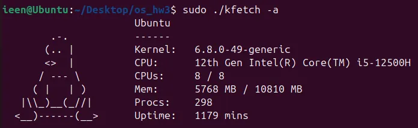

# Assignment 3

This repository contains the implementation for assignment 3 of the Operating Systems course.
[View full specification on HackMD](https://hackmd.io/@fLANt9b6TbWx5I3lYKkBow/SysmmarM1l)

<p align="left">
  
</p>

## Overview

In this assignment, we developed a Linux kernel module named `kfetch_mod` that provides system information through a character device `/dev/kfetch`. The module retrieves and displays details similar to the `neofetch` tool, including:

- **Kernel**: Kernel release version
- **CPU**: CPU model name
- **CPUs**: Number of CPU cores (`<online CPUs> / <total CPUs>`)
- **Mem**: Memory usage (`<free memory> / <total memory>` in MB)
- **Procs**: Number of processes
- **Uptime**: System uptime in minutes

Users can customize the displayed information by writing a specific bitmask to the device.

## Directory Structure

- `kfetch_mod.c` – Source code for the kernel module
- `kfetch.c` – User-space program to interact with `/dev/kfetch`
- `Makefile` – Build script for compiling the kernel module and test program

## Usage

1. Build the module and test program:
   ```
   make
   ```
2. Load the module
   ```
   make load
   ```
4. Run the user-space test program
   ```
   gcc -o kfetch kfetch.c
   ./kfetch
   ```
6. Unload the module
   ```
   make unload
   ```
8. Clean up build files
   ```
   make clean
   ```

